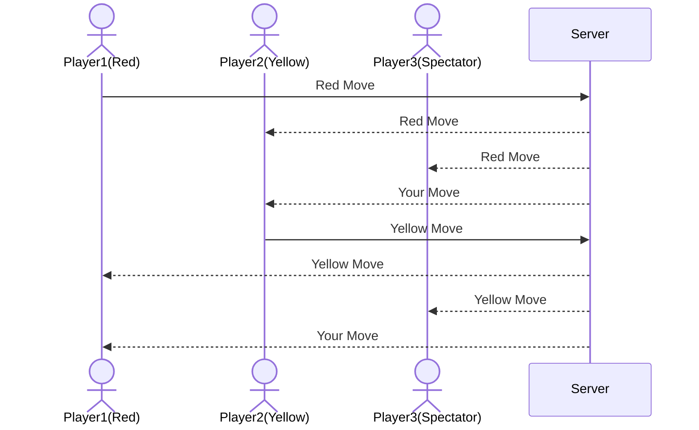

# startup
Startup application for BYU CS 260 - Connect 4
A classic game recreated by a classy individual

## Specification Deliverable
### Elevator Pitch

Have you ever been unable to decide the smartest in the room? You may need to make a decision but are unsure who has the smartest opinion. Well, my website can help you solve that... through a classic game of Connect 4! This challenge of wits will allow you to determine in a quick match who is the wisest in the room and whose opinion you should listen to. What if there is a draw? You can line it up and go again! Solving a time-old problem from the convenience of your computer.

### Design

Here is a sequence diagram that shows how users would interact with the backend to play and watch:

### Key Features
- Secure login over HTTPS
- Display start game or spectate game options
- Join a game and play with one other user
- Logic built in for how to win the game
- Moves of other players are displayed in real time
- Results of games (wins and losses per user) are stored within a database

### Technologies
I am going to use the required technologies in the following ways:

- **HTML** - Three application pages, one with a login, one where you start the game (if a game is already going you will have to just spectate), one where you play, and one with a leaderboard function
- **CSS** - The pieces on the game board and animations of dropping pieces across different devices
- **React** - Provides login, where you can drop your piece, and display other moves
- **Service** - Backend service with endpoints for:
  - login
  - retrieving recently done moves
  - keeps track of votes overall
  - displyaing a random inspirational quote using an external service
- **DB/Login** - Store users as well as active games in a database. Register and login users, with credentials stored in the database. Cannot play until authenticated. Storing overall records of users
- **WebSocket** - Whenever one move is taken, it gets broadcast to all other boards
