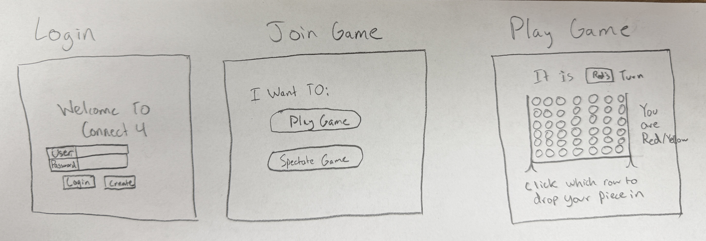
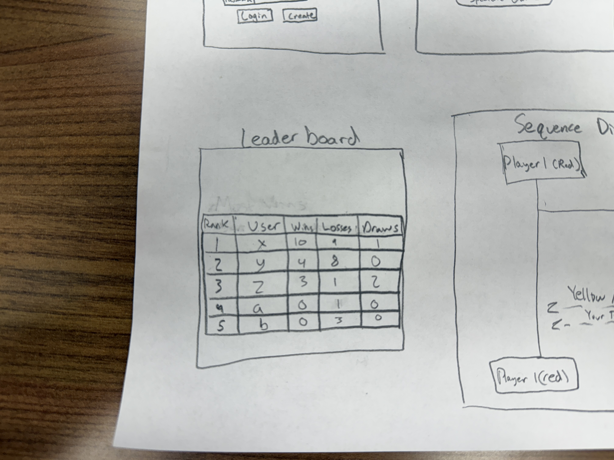
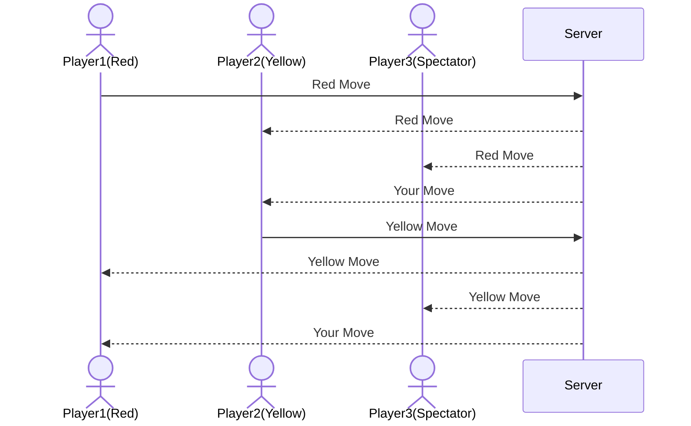

# startup
Startup application for BYU CS 260 - Connect 4
A classic game recreated by a classy individual

## Specification Deliverable
### Elevator Pitch

Have you ever been unable to decide the smartest in the room? You may need to make a decision but are unsure who has the smartest opinion. Well, my website can help you solve that... through a classic game of Connect 4! This challenge of wits will allow you to determine in a quick match who is the wisest in the room and whose opinion you should listen to. What if there is a draw? You can line it up and go again! Solving a time-old problem from the convenience of your computer.

### Design

These are some hand-drawn designs for the Connect 4 website:

Here is a sequence diagram that shows how users would interact with the backend to play and watch:

### Key Features
- Secure login over HTTPS
- Display start game or spectate game options
- Join a game and play with one other user
- Logic built in for how to win the game
- Moves of other players are displayed in real time
- Results of games (wins and losses per user) are stored within a database

### Technologies
I am going to use the required technologies in the following ways:

- **HTML** - Three application pages, one with a login, one where you start the game (if a game is already going you will have to just spectate), one where you play, and one with a leaderboard function
- **CSS** - The pieces on the game board and animations of dropping pieces across different devices
- **React** - Provides login, where you can drop your piece, and display other moves
- **Service** - Backend service with endpoints for:
  - login
  - retrieving recently done moves
  - keeps track of moves overall
  - displyaing a random inspirational quote using an external service
- **DB/Login** - Store users as well as active games in a database. Register and login users, with credentials stored in the database. Cannot play until authenticated. Storing overall records of users
- **WebSocket** - Whenever one move is taken, it gets broadcast to all other boards

## HTML Deliverable

For this deliverable I built out the structure of my application using HTML.

- [x] **HTML Pages** - Four HTML pages that represent the ability to login/create, play a game, a database page and an about screen.

- [x] **Body, Nav, Main, Header, and Footer** - Each page has the same header and footer, with the footer containing my name and github. The Nav section of each page directs you to each of the 4 different pages. Main and body are on each page containing the majority of the text for each page.

- [x] **Link Between Pages** - Each page contains links to all 4 pages.

- [x] **Application Textual Content** - The about page has text about the game, as well as the history of the game. The play game page also has instructions for your turn.

- [x] **Placeholder for 3rd Party Service Call** - On the about page, there is a placeholder for a call to a website that generates random inspirational quotes.

- [x] **Application Images** - On the home page, as well as on the play game page there are images of the Connect 4 game. The Connect 4 game on the play game page also has buttons underneath for functionality. There is also a button to end the game early.

- [x] **Login Placeholder, including username display** - There is a login placeholder on the home page, as well as a username display on the play game page to show who is playing.

- [x] **Database Placeholder** - The database page contains the table with information that will be stored, including wins, losses, and draws. 

- [x] **WebSocket Data Placeholder** - On the play game page, there will be notifications sent about who is playing the game and whose turn it is, incluidng if there are any spectators. It will also announce a winner when the game ends.

- [x] **Styling** - I also added a bit of impromptu styling with HTML to make things flow and look a little more presentable. This includes dividers between header and footer, as well as some buttons and header texts.

## CSS Deliverable

For this deliverable I properly styled the applications into its final appearance.

- [x] **Header, Footer, and Main Content Body** - Created styling for each header and footer, as well as the main content body of each page.

- [x] **Navigation Elements** - Got rid of the underlines for the main navigation pieces in the header, and then changed the color to match the theme. I did not change the github link because I felt that this would emphasize the fact that it was a link.

- [x] **Responsive to Window Resizing** - The app looks good on all window sizes and devices. If it gets really small then I feel it would be impractical, but that is likely the same for all tiny screens.

- [x] **Application Elements** - Emphasized contrast and whitespace. The layout has been changed to be centered on the page and emphasize the main parts of each page. Included boxes for some of the text to make things more readable and broken up. Also changed some of the buttons to be better styled.

- [x] **Application Text Content** - Consistent sans-serif font across the whole website, with sizes and bold differing when needed.

- [x] **Applicaiton Images** - Styled the image on the home screen with padding added, as well as an image-like table on the Play Game page.

## REACT Phase 1

For this deliverable I changed my base frol HTML to the react framework, editing the code to have all design and functionality passed on.

- [x] **Main Index File** - Created an index file that acts as the main center for naviation, with all other jsx files being directed by it.

- [x] **CSS Functionality** - Reworked a few design elements that did not work immediately on the switch to JSX and React

- [x] **Added JSX files for each endopoint** - Each page is able to be naviagted to theough the navifation function on the header.

- [x] **Worked Through All Steps In Simon React Instruction** - Completed all steps that were undertaken in the Simon React transition. Adressed edits to "class" turnign them into "className" and followed steps to deploy and transition from HTML framework.

## REACT Phase 2

For this deliverable I used JavaScript and React so that the application completely works for a single user. I also added placeholders for future technology.

- [x] **All functionality implemented or mocked out** - Each page has all functionality at least mocked out. 
  - [x] **About** Page I mocked out implementation of the 3rd party service call to upload a quote. 
  - [x] **Login** I implemented the Login page that now allows the user to login with authenticated and unauthenticated states. The user info is currently being stored in local memory. 
  - [x] **PlayGame** I  implemented functionality for the play game tab. This includes the logic of how to play connect4. I also changed the functionality so that instead of playing against another player, you are now playing against the computer for ease of implementation. This page also accepts notifications which are randomly generated for now. 
  - [x] **Database** I also implemented the database table. This adds new lines to the table whenever a game is completed. I changed the functionality to focus on just putting the games played in the table, rather than the previously desired functionality. Currently the winners are stored in local memory.

- [x] **Hooks** - Used useState and useEffect hooks throughout the website with some implementation on each phase. The clearest examples of this are the useEffect with the notifications and score updateing, as well as useState within the play game, whose turn is it, functionality.

## Service deliverable

For this deliverable I added backend endpoints that creates login functionality, as well as stores users outside of just local storage. It also uses a third party endpoint.

- [x] **Node.js/Express HTTP service** - Completed adding the Node.js/Express HTTP service. 
- [x] **Static middleware for frontend** - Added to index.js to serve files from the public directory.
- [x] **Calls to third party endpoints** - I added a third party endpoint that recieves a chuck norris joke on my about page. This is located in the about.jsx file.
- [x] **Backend service endpoints** - The login is set up on the backend to login, verify, and store users. Same with the resulsts. They are put into the table upon transfering to the results database tab.
- [x] **Frontend calls service endpoints** - Fetch function calls the backend for creating a user, logging in, logging out, and for the restult updated upon winners of a game.
- [x] **Supports registration, login, logout, and restricted endpoint** - This functionality is supported. Restricted endpoints include the results transfer into the file.

## Database deliverable

For this deliverable I added the connection ability with the MongoDB database connections. Login credentials are stored through Mongo and so are the wins of recent games.

- [x] **Stores Data in MongoD** - Both the login credentials and wins results are stored in MongoDB. Changed database functionality to only show the most recent 10 games.
- [x] **Use MongoDB to store credentials** - Login credentials are stored within MongoDB. Those not logged in are still unable to play and credentials are held through multiple log ins and outs as well as leaving the server.