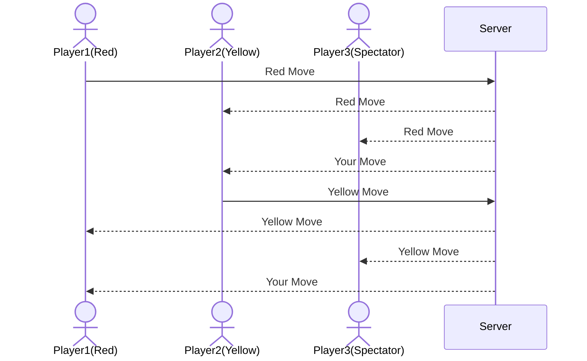

# startup
Startup application for BYU CS 260 - Connect 4
A classic game recreated by a classy individual

## Specification Deliverable
### Elevator Pitch

Have you ever been unable to decide the smartest in the room? You may need to make a decision but are unsure who has the smartest opinion. Well, my website can help you solve that... through a classic game of Connect 4! This challenge of wits will allow you to determine in a quick match who is the wisest in the room and whose opinion you should listen to. What if there is a draw? You can line it up and go again! Solving a time-old problem from the convenience of your computer.

### Design

These are some hand-drawn designs for the Connect 4 website:

Here is a sequence diagram that shows how users would interact with the backend to play and watch:

### Key Features
- Secure login over HTTPS
- Display start game or spectate game options
- Join a game and play with one other user
- Logic built in for how to win the game
- Moves of other players are displayed in real time
- Results of games (wins and losses per user) are stored within a database

### Technologies
I am going to use the required technologies in the following ways:

- **HTML** - Three application pages, one with a login, one where you start the game (if a game is already going you will have to just spectate), one where you play, and one with a leaderboard function
- **CSS** - The pieces on the game board and animations of dropping pieces across different devices
- **React** - Provides login, where you can drop your piece, and display other moves
- **Service** - Backend service with endpoints for:
  - login
  - retrieving recently done moves
  - keeps track of moves overall
  - displyaing a random inspirational quote using an external service
- **DB/Login** - Store users as well as active games in a database. Register and login users, with credentials stored in the database. Cannot play until authenticated. Storing overall records of users
- **WebSocket** - Whenever one move is taken, it gets broadcast to all other boards

## HTML Deliverable

For this deliverable I built out the structure of my application using HTML.

- [x] **HTML Pages** - Four HTML pages that represent the ability to login/create, play a game, a database page and an about screen.
- [x] **Body, Nav, Main, Header, and Footer** - Each page has the same header and footer, with the footer containing my name and github. The Nav section of each page directs you to each of the 4 different pages. Main and body are on each page containing the majority of the text for each page.

- [x] **Link Between Pages** - Each page contains link to all 4 pages.

- [x] **Application Textual Content** - The about page has text about the game, as well as the history of the game. The play play game page also has instructions for your turn.

- [x] **Placeholder for 3rd Party Service Call** - On the about page, there is a placeholder for a call to a website that generates random inspirational quote.

- [x] **Application Images** - On the home page, as well as on the play game page there are images of the Connect 4 game. The Connect 4 game on the play game page also has buttons underneath for functionality.

- [x] **Login Placeholder, including username display** - There is a login placeholder on the home page, as well as a username display on the play game page to show who is playing.

- [x] **Database Placeholder** - The database page contains the table with the information that will be stored, including wins, losses and draws. 

- [x] **WebSocket Data Placeholder** - On the play game page, there will be notifications sent about how is playing the game and whose turn it is, incluidng if there are any spectators.