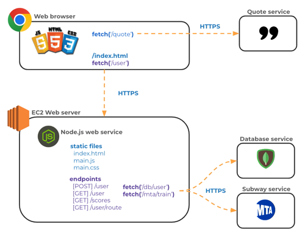

Notes File

To ssh into my server: ssh -i /Users/nathanweidenhamer/Documents/CS/CS\ 260/procedure.pem ubuntu@3.213.131.226

IP Address: http://3.213.131.226/

AWS Route 53 is how to register a domain name. They have plenty of documentation to help out. Creating Roots will allow you to access the website.

wagonhamsterconnect4.click

HTML Learnings:
nav and a href for links to other pages
header and footer across all pages
main and body to produce text main stays
Codepen account has a lot of good practice on HTML images, buttons/submitting, and structure.
Adding &nbsp; can provide some spaces into the line without going to a new line.
Table, TR, TH, TD for creation of a table.
Form/input to create an input for login/password.

Things to look into: How to make the pieces work on the Connect 4 gameboard.

Creating a new css file, you must include it at the top to adopt into the file

use the class = "" feature and put the name in the css file with everything you want to add to that specific feature

Use the inspect feature by right clicking on the google chrome thing you want to dive into the css on.

This may seem like a lot of work but after you do it a few times it will begin to feel natural. Just remember the main steps.

For Using Node.js
Create your project directory
Initialize it for use with NPM by running npm init -y
Make sure .gitignore file contains node_modules
Install any desired packages with npm install <package name here>
Add require('<package name here>') to your application's JavaScript
Use the code the package provides in your JavaScript
Run your code with node index.js

Moving things into the react functionality is easy, but your CSS needs to mostly be reactive, instead of fixed. When transfering over, you end up deleting the htmls and have the new jsx do all the work for you.

React Part 2
Arrow Functions can be used in place of functions to make the code more compact
Arrays are like lists and have a number of pre-programmed methods
Objects are like dictionaries, they have a number of use cases and you must do JSON when reading them
React Hooks like useEffect and useState are used to be able to do style components
Reactivity is based on states and essentailly you change the state and then tell React to update and look at the state
The Simon Repository can be a great place to get some feeling for how things work

The functionality within VS code for checking whether code is correct is not as built out as in python, so when checking for errors, first jsut make sure all the variables are correct.

Using different useStates allows for different authentication status or whose turn it is. useEffect works well on like a, when this first loads, or when this happens, do this thing.

Startup Service: 

Codepen for Fetching a third party service: https://codepen.io/Nathan-Weidenhamer/pen/OPJxgPV?editors=0010

NPM is a powerful tool when using vite and node to make the backend and frontend work

When working in the front end and backend,it appears that the best method is to open up two terminals, run npm run dev in one and access the service directory on the other terminal, and run node index.js

To debug the front end, using the dev tools on the browser is the best method. To debug the back end, using the IDE debug is the best tool. 

Breakpoints are key in both front end and back end debugging.